# 📚 Java 8 - Streams: Mapeamento, Agrupamento, Particionamento e Paralelismo

Este projeto contém uma série de exercícios práticos com foco no uso da **API de Streams do Java 8**, explorando desde operações básicas até composições mais avançadas de *Collectors*.

---

## 🚀 Tecnologias utilizadas

- Java 8+
- API de Streams
- IntelliJ IDEA

---

## 📌 Objetivo

Praticar e consolidar conceitos de programação funcional em Java, utilizando Streams para manipulação de coleções de forma declarativa, legível e eficiente.

---

## 📂 Estrutura do Projeto

O projeto simula cenários comuns de aplicações reais com as seguintes entidades:

- `Livro`
- `Venda`
- `Funcionario`
- `Filme`
- `Pedido`

Cada domínio foi utilizado para aplicar diferentes operações com Streams.

---

## 🧠 Desafios Implementados

### 📚 Desafio 1 - Catálogo de Livros

#### • Extração de títulos com `map`
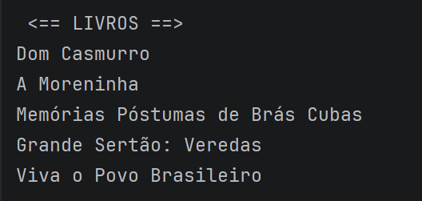
#### • Agrupamento por autor com `groupingBy` + `mapping`
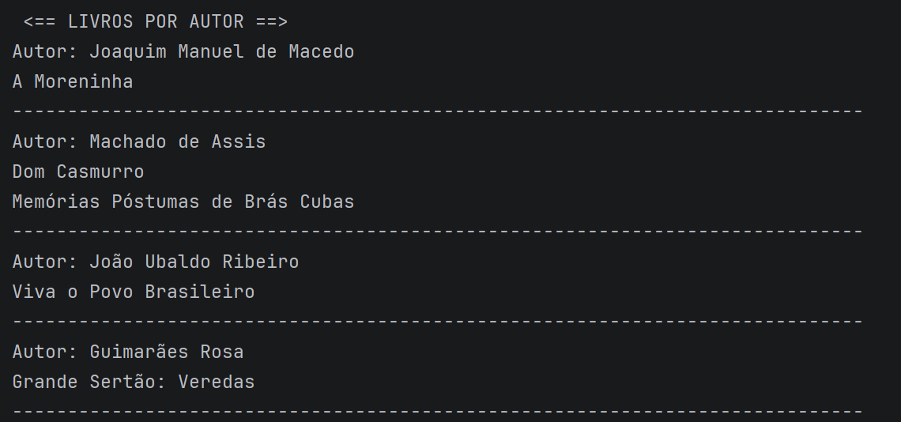
#### • Particionamento por número de páginas
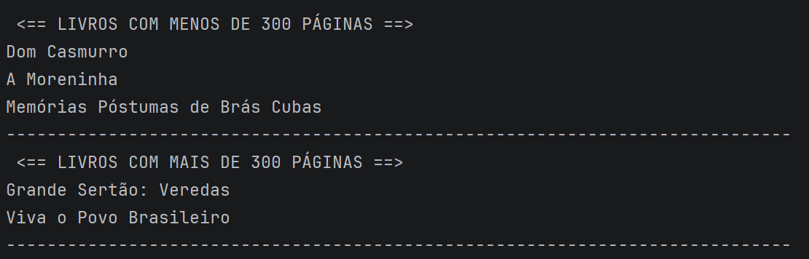
#### • Soma total de páginas (uso didático de `parallelStream`)
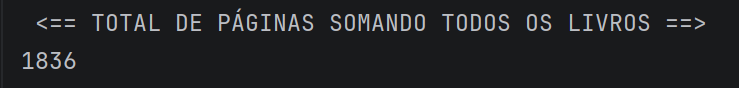

---

### 🛍️ Desafio 2 - Sistema de Vendas

#### • Média de valores por categoria (`averagingDouble`)
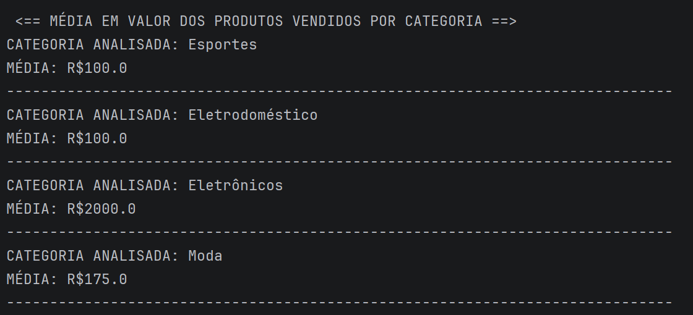
#### • Particionamento por valor (> R$500)
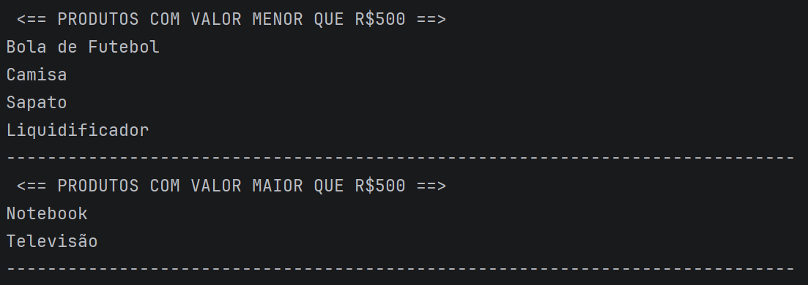
#### • Transformação para lista de produtos vendidos
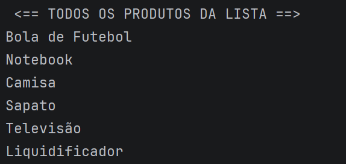

---

### 👨‍💼 Desafio 3 - Cadastro de Funcionários

#### • Agrupamento por departamento
- Identificação do funcionário mais velho por departamento:
  - Uso de `maxBy`
  - `Comparator` encadeado com critério de desempate por nome
  - Uso de `collectingAndThen` para remover `Optional`
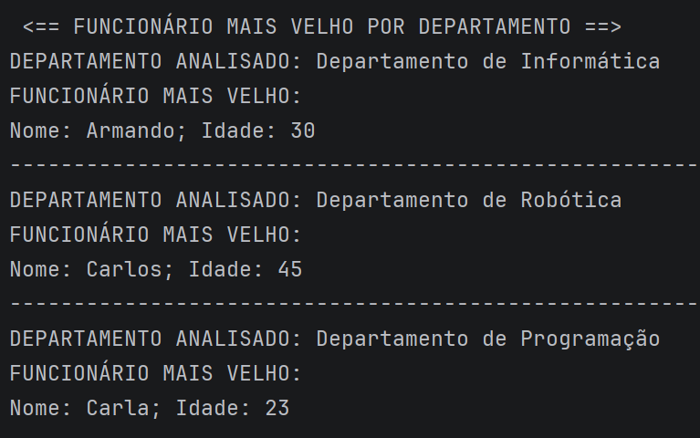
#### • Soma das idades com particionamento (> 40 anos)
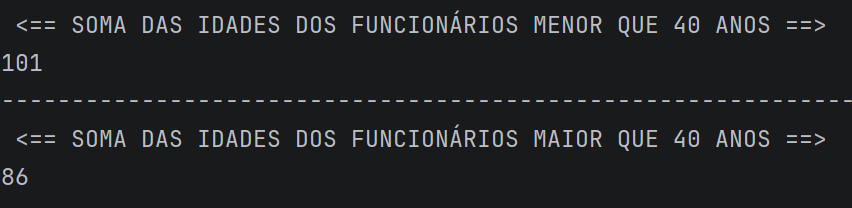

---

### 🎬 Desafio 4 - Plataforma de Filmes

#### • Média de avaliação por gênero
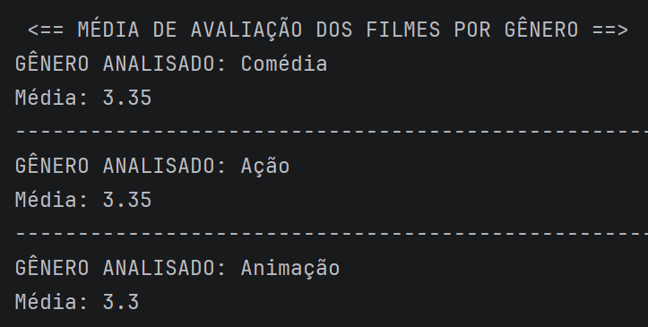
#### • Particionamento por avaliação (>= 3.5)
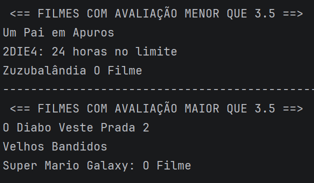
#### • Filtro de filmes com alta avaliação (>= 3.7)
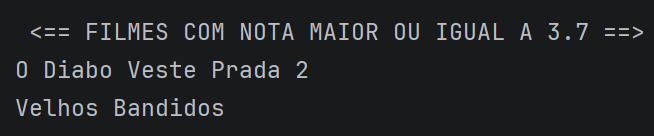

---

### 🛒 Desafio 5 - E-commerce

#### • Soma total de pedidos (`parallelStream` para fins didáticos)
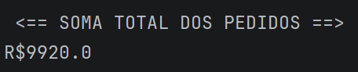
#### • Agrupamento por status
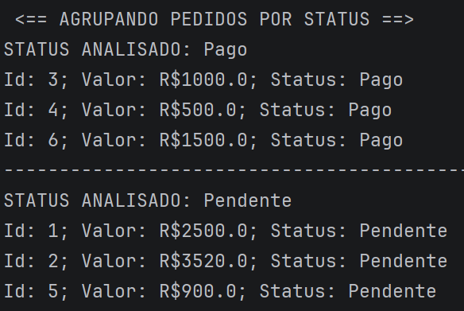
#### • Particionamento por valor (> R$1000)
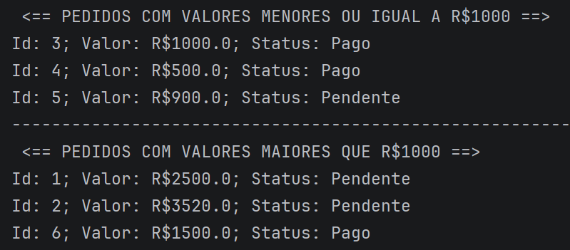
#### • Extração de IDs dos pedidos
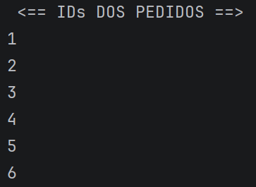

---

## ⚙️ Conceitos Aplicados

- `map`, `filter`
- `mapToInt`, `mapToDouble`
- `collect`
- `Collectors.groupingBy`
- `Collectors.partitioningBy`
- `Collectors.mapping`
- `Collectors.averagingDouble`
- `Collectors.summingInt`
- `Collectors.maxBy`
- `Collectors.collectingAndThen`
- `Comparator.comparing` e `thenComparing`
- `Optional` e `Optional::orElseThrow`
- `parallelStream` (uso controlado)

---

## ✔ Boas práticas aplicadas
- Código organizado por domínio (livros, vendas, etc.)
- Saídas formatadas para melhor leitura
- Nomes de variáveis mais descritivos
- Redução de ambiguidade em critérios de filtragem

---

## ⚠️ Observações
- O uso de parallelStream foi mantido com fins didáticos.
- Em cenários reais, deve ser utilizado apenas com grandes volumes de dados e operações custosas.

---

## 📈 Aprendizados
- Escrita de código mais declarativo com Streams
- Uso de coletores compostos
- Controle fino de ordenação com Comparator
- Tratamento de resultados com Optional
- Organização de dados em estruturas como Map e List
